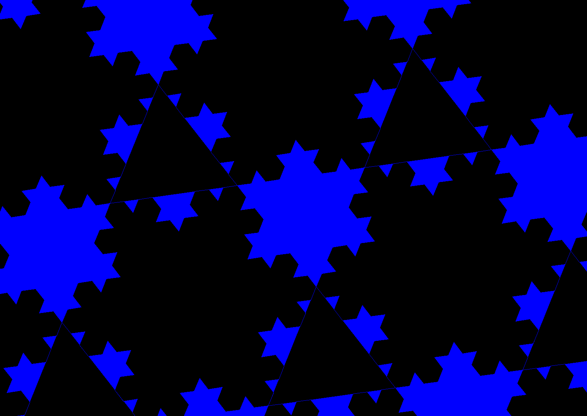
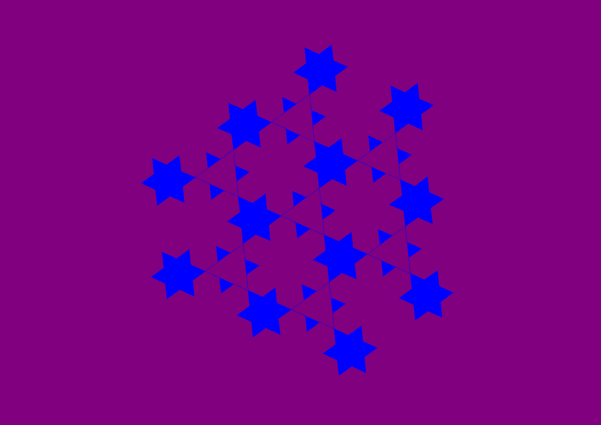
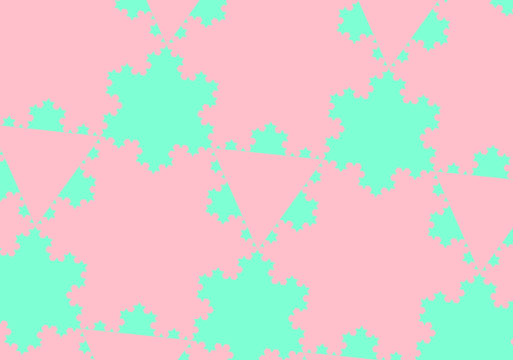

# Koch Snowflake Generator by Nguyen Doan

## How to use

When you run the program, it will ask you for these settings for the Koch Snowflake:  
* The level of the Koch Snowflake 
* The level of the Koch Snowflakes surrounding one
* The size of one Koch Snowflake
* The colour of the Koch Snowflakes
* The colour of the background
* If you want an inverse design

After entering these values, the program will generate an animation of Koch snowflakes spinning with the settings you chose

## How it works

The program relies on two functions to draw the image: `kochLine()` and `kochSnowflake()`

### `kochLine()` 
`kochLine()` is the main function that draws the image and the basic recursive function that the program revolves around. 

`kochLine()` will draw a line if it's the base case, else it would call itself 4 times, creatin the following lines depending on its recursion level   

### `kochSnowflake()`

`kochSnowflake()` will draw a full Koch Snowflake with its settings by drawing three `kochLine()`  and making a triangle

To create the spinning animation, `turtle.tracer(0)` and `turtle.update()` are used to create frames of animations while the turtle spins by 1 degree inbetween every `turtle.update()`

## Test cases:

#### Input: 2, 3, 123, blue, purple, n   

#### Input: 4, 3, 345, aquamarine, pink, n   

#### Input: 3, 3, 250, green, black, y   

## Additional Notes
* For recursion levels, it is recommended to not go above 4 on any of the recursion settings, for it causes extreme lag due to the amount of lines required to draw to create the animation
