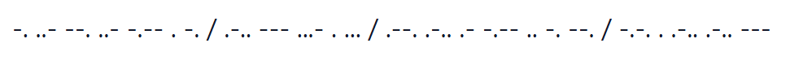
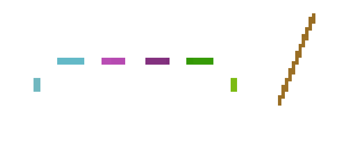
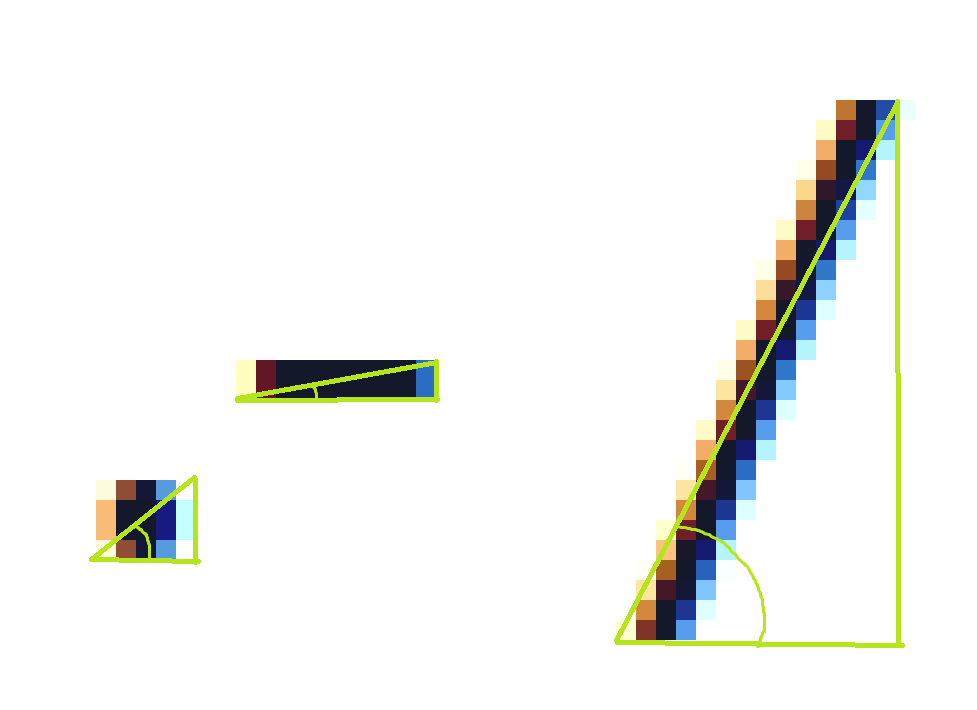
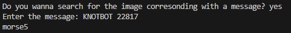

# MORSE-IMAGES-TRANSLATEINATOR
### by Nguyen Doan



## Project Description: 
The Translateinator will take images of morse code messages and translate them into morse code text by detecting different "blobs" of characters and categorizes  them, which is then translated to English and sorted alphabetically<br>
Inspired and uses some processes in Optical Character Recognition, which is commonly used to process images into text files.

## Process:
> ### Initialization
To help with processing the image, the program get ready by binarizing the image
and making a 2D array copy of the image's pixels:
```
for y in range(height):
        imgLabels.append([])
        for x in range(width):
            imgLabels[y].append("")
```

> ### Labeling
Labeling is the process of giving each pixel a label correspondent with its "shape", allowing the grouping of pixels and formation of the individual characters<br>
To label, we use a recursive funtion that, after a successful label attempt, will label the pixels surrounding itself. 
```
def labelPixel(img, x, y, label, imgLabels, width, height):
    if imgLabels[y][x] == "":
        r, g, b, a = img[x, y]
        if r<120 and g<120 and b<120:
            imgLabels[y][x] = label
            for x_pos in range(x-1, x+2):
                for y_pos in range(y-1, y+2):
                    if 0 <= x_pos <= width and 0 <= y_pos <= height:
                        labelPixel(img, x_pos, y_pos, label, imgLabels, width, height)
            return True
        else: 
            imgLabels[y][x] = 0
            return False
    else:
        return False
```
The true or false that the function returns tells the program if a new "shape" was discovered 
```
if labelPixel(img, x, y, labelNum, imgLabels, width, height):
    labelNum += 1
```
<br>
fig 1: a visualization of the labeling system, with each shape having a different colour. Ignore the first two being similar since this image was produced with random colours assigned

> ### Identifying
After each shape is labeled, the program goes through each of those labels and identify each shape as a ".", "-", "/", or " "<br>
By getting the extremes of a shape, we can identify it by getting the angle of the line directly across the shape using arctan:<br>
<br>
fig 2: by using the shape's height and width, you can calculate the angle of the diagonal line created from the extremes of the shape and identify it.<br>

All of these characters are compiled into a string containing all of the morse code from the image, with spaces denoting the different "letters"

> ### Translating
By spliting the string into a list, we can then compare every set of morse and translate all into English using a dictionary. The sentence is reconstructed and returned. The output is then added to a list of messages.
```
morseList = []
for i in range(1, 11):
    morseList.append(translateMorseImage(f"6.7/morse_images/morse{i}.png"))
```

> ### Sorting & Searching
After the list is completed, the messages are sorted alphabetically through selection sort. <br>
A binary searching program is made, which takes a message as an input and returns the image associated with that message. It returns nothing if the program can't find a match.
```
message = input(("Enter the message: "))
        low = 0
        high = len(morseList)-1
        found = False
        while low < high:
            middle = int((low+high)/2)
            if morseList[middle][0] == message:
                print(f"morse{middle+1}")
                found = True
                break
            elif compareString(morseList[middle][0], message) == morseList[middle][0]:
                high = middle-1
            else:
                low = middle+1
        if not found:
            print("The message does not have an image associated with it")
```
<br>
fig. 3: an example of using the binary search function<br>

*Note: I didn't know that strings could be compared alphabetically using < and >, which resulted me in creating multiple functions to help sort the strings, like the compareString() function seen above.*

## Testing:
With every major developement in the code, some testing is done to ensure that the code is working as intended.<br>
1. After developing the labeling system, the images were modified to have a different colour based on their label, as shown in fig. 1. This helped visualizing the different groupings and showed any errors.
2. During the period when I was working on translating the characters into morse,  